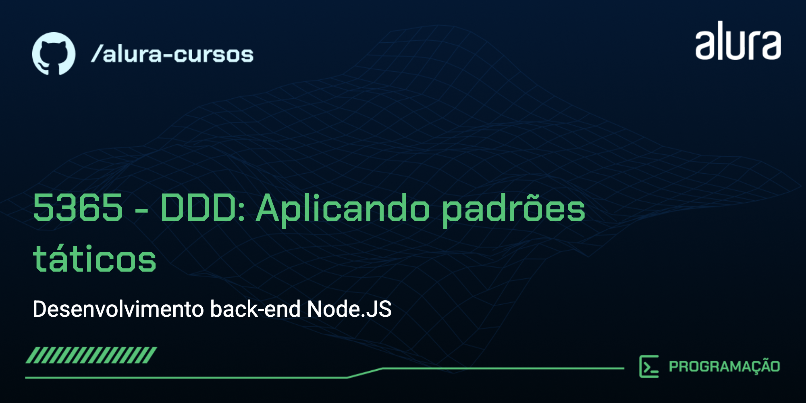

# Padrões Táticos de DDD - Gestão de Pedidos para E-commerce

Projeto educacional em NestJS que demonstra os **padrões táticos de Domain-Driven Design** através de um fluxo de gerenciamento de pedidos de e-commerce. O sistema cobre a criação do carrinho de compras, fechamento do pedido e o processamento de pagamentos, de forma simplificada, com objetivo de aprendizado do DDD.

## 🔨 Funcionalidades do projeto

O projeto implementa um sistema de gerenciamento de pedidos com as seguintes funcionalidades:

- **Carrinho de Compras**: Criação e gerenciamento de carrinhos de compras com validação de regras de negócio
- **Criação de Pedidos**: Transformação de carrinhos em pedidos com cálculo de preços
- **Processamento de Pagamento**: Integração com contexto de pagamentos (síncrona e assíncrona)
- **Eventos de Domínio**: Comunicação entre contextos delimitados através de eventos
- **Consistência Eventual**: Implementação de arquitetura orientada a eventos com message bus

## ✔️ Técnicas e tecnologias utilizadas

As técnicas e tecnologias utilizadas no projeto são:

- `Agregados`: Cluster de objetos de domínio tratados como uma unidade única, com uma entidade raiz que controla acesso e garante invariantes dentro de limites transacionais
- `Objetos-Valor`: Objetos imutáveis que descrevem características do domínio sem identidade conceitual, eliminando obsessão por tipos primitivos (Money, Quantity)
- `Entidades`: Objetos com identidade única que persiste ao longo do tempo e através de diferentes estados
- `Repositório`: Abstração que media entre a camada de domínio e a camada de mapeamento de dados, encapsulando lógica de persistência de agregados
- `Serviços de Domínio`: Operações de negócio que não pertencem naturalmente a uma entidade ou objeto-valor, coordenando múltiplos agregados
- `Serviços de Aplicação`: Camada de orquestração que coordena casos de uso, delegando lógica de negócio ao domínio
- `Gateway`: Interface que encapsula acesso a sistemas externos, permitindo substituição e testabilidade
- `Camada Anti-Corrupção`: Camada de tradução que protege o modelo de domínio de conceitos e estruturas de modelos externos
- `Contextos Delimitados`: Fronteiras explícitas onde um modelo particular de domínio é definido e aplicável, com linguagem ubíqua consistente
- `Eventos de Domínio`: Representação de ocorrências no domínio que são importantes para especialistas de negócio e podem desencadear reações
- `Message Bus`: Infraestrutura para comunicação assíncrona pub/sub entre contextos, promovendo baixo acoplamento
- `Arquitetura Orientada a Eventos`: Estilo arquitetural baseado na produção, detecção e reação a eventos, permitindo consistência eventual entre contextos

## 📚 Jornada de Aprendizado

### Aula 1: Iniciando com Padrões Táticos

**Conceitos Centrais:** Agregados, Objetos-Valor, Entidades, Repositório

Aprendizado dos blocos fundamentais do DDD implementando um carrinho de compras:

- Construir **Objetos-Valor** (Money, Quantity) para eliminar a obsessão por primitivos
- Criar o **Agregado ShoppingCart** com regras de negócio e gerenciamento de estado
- Implementar o **Repositório** para abstração de persistência
- Entender **limites de agregado** e garantias de consistência
- Integrar com serviços de aplicação e controllers do NestJS

**Principais Aprendizados:** Como agregados fazem cumprir invariantes e mantêm consistência dentro de limites transacionais.

---

### Aula 2: Serviços de Domínio e de Aplicação

**Conceitos Centrais:** Serviços de Domínio, Serviços de Aplicação, Gateway, Camada Anti-Corrupção

Transformar carrinhos de compras em pedidos enquanto coordena com contextos externos:

- Modelar o **Agregado Order** com ciclo de vida distinto do ShoppingCart
- Construir **Serviços de Domínio** para operações que abrangem múltiplos agregados
- Implementar o **Gateway** para integração com contexto externo de Pricing
- Aplicar **Camada Anti-Corrupção** para isolar o domínio de modelos externos
- Orquestrar fluxos complexos com **Serviços de Aplicação**

**Principais Aprendizados:** Como serviços de domínio coordenam operações de negócio mantendo a lógica do domínio pura e isolada de dependências externas.

---

### Aula 3: Integração entre Contextos

**Conceitos Centrais:** Contextos Delimitados, Integração entre Contextos

Implementar o processamento de pagamento síncrono entre contextos delimitados:

- Criar um **Payments Bounded Context** separado (simulando microsserviços)
- Usar o **Gateway** para comunicação entre contextos
- Aplicar **Camada Anti-Corrupção** entre contextos

**Principais Aprendizados:** Como contextos delimitados mantêm autonomia enquanto se integram de forma síncrona com garantias de consistência imediata.

---

### Aula 4: Eventos de Domínio e Consistência Eventual

**Conceitos Centrais:** Eventos de Domínio, Arquitetura Orientada a Eventos, Message Bus, Consistência Eventual

Refatorar o processamento de pagamento para uma arquitetura orientada a eventos:

- Implementar **Eventos de Domínio** para capturar momentos do negócio
- Construir infraestrutura de **Message Bus** para comunicação pub/sub
- Criar **Publishers** e **Handlers** de eventos
- Aplicar **Camada Anti-Corrupção** aos payloads de eventos
- Entender as trocas relativas à **consistência eventual**

**Principais Aprendizados:** Como a arquitetura orientada a eventos permite baixo acoplamento entre contextos delimitados, aceitando a consistência eventual.

---

## 📁 Acesso ao projeto

Você pode [acessar o código fonte do projeto](https://github.com/alura-cursos/ddd-aplicando-padroes-taticos) ou cloná-lo usando:

```bash
git clone https://github.com/alura-cursos/ddd-aplicando-padroes-taticos.git
```

## 🛠️ Abrir e rodar o projeto

Após clonar o projeto, você precisa instalar as dependências e executá-lo:

### Configuração do projeto

```bash
$ npm install
```

### Compilar e executar o projeto

```bash
# modo de desenvolvimento
$ npm run start

# modo watch
$ npm run start:dev

# modo produção
$ npm run start:prod
```

### Executar testes

```bash
# testes unitários
$ npm run test

# testes e2e
$ npm run test:e2e

# cobertura de testes
$ npm run test:cov
```

### Testar a API

Você pode executar operações na API através do arquivo `api.http` utilizando a extensão [REST Client](https://marketplace.visualstudio.com/items?itemName=humao.rest-client) para Visual Studio Code.

Após instalar a extensão, abra o arquivo `api.http` e clique em "Send Request" acima de cada requisição HTTP para executá-la e visualizar a resposta diretamente no editor.
